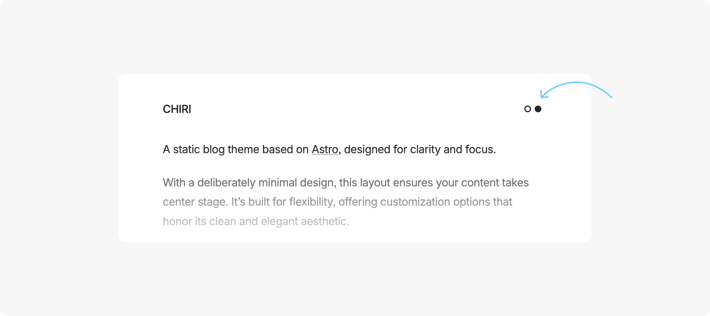
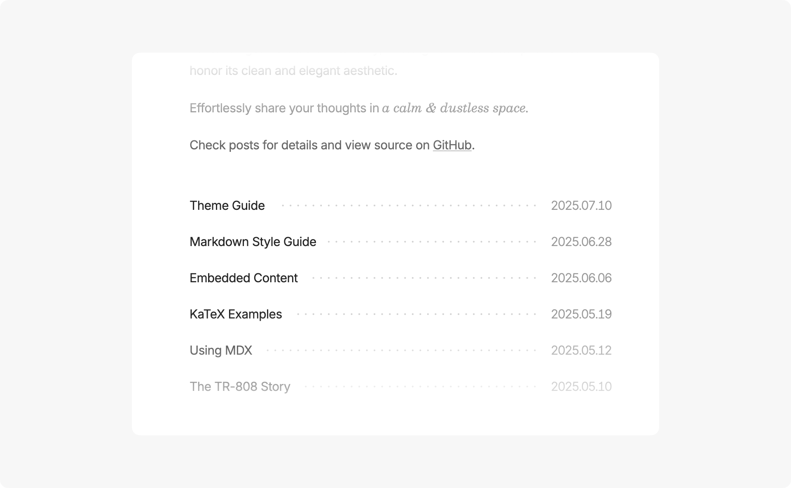
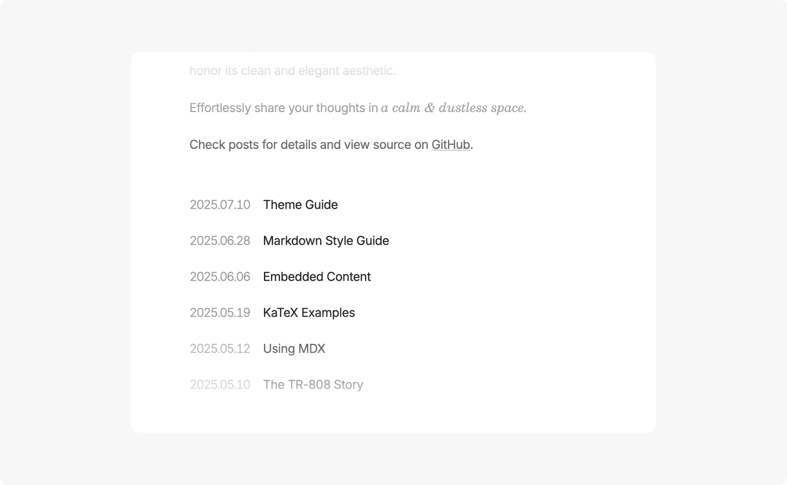
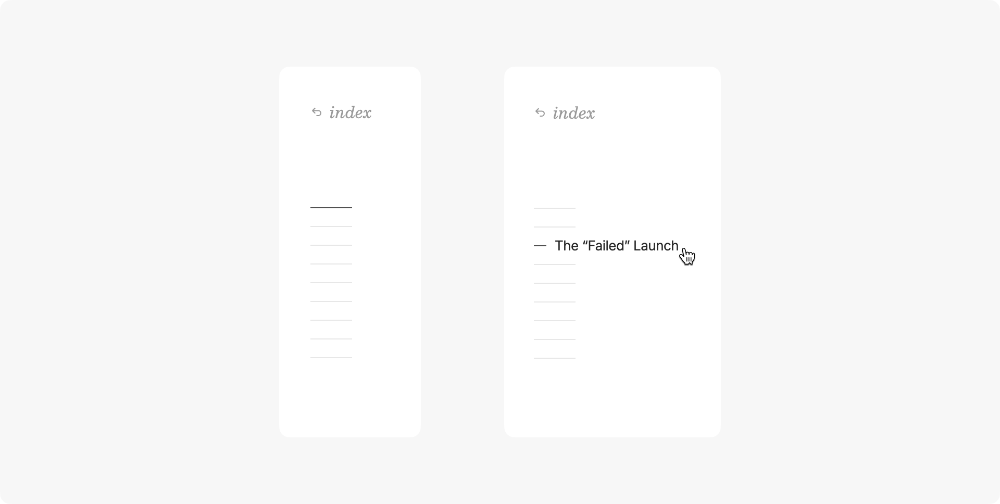
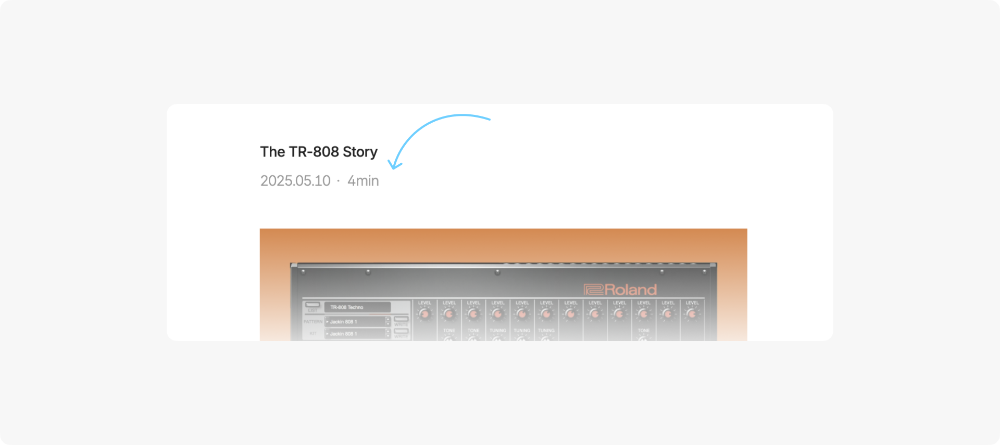
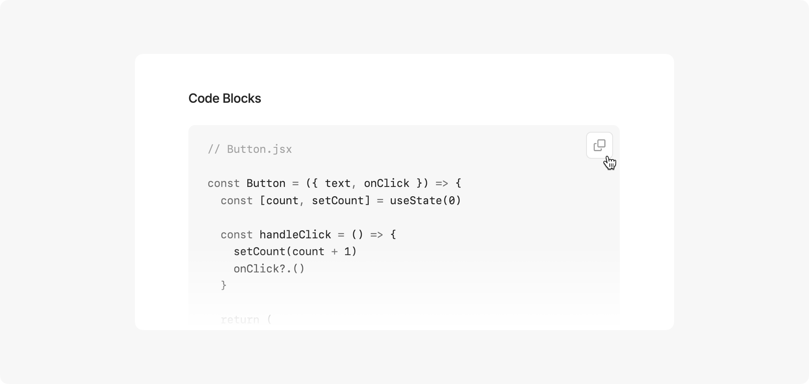

Chiri is a minimal blog theme built with [Astro](https://astro.build), offering customization options while preserving its clean aesthetic.

---

## Basic Commands

- `pnpm new <title>` - Create a new post (use `_title` for drafts)
- `pnpm update-theme` - Update the theme to the latest version

## Main Files & Directories

- `src/content/about/about.md` - Edit the about section of the index page. Leave it empty if you don't want any content.
- `src/content/posts/` - All blog posts are stored here
- `src/config.ts` - Configure main site info and settings

```ts
// Site Info

site: {
  // Site domain
  website: 'https://astro-chiri.netlify.app/',
  // Site title
  title: 'CHIRI',
  // Author name
  author: '3ASH',
  // Site description
  description: 'Minimal blog built by Astro',
  // Default language
  language: 'en-US'
},
```

```ts
// General Settings

general: {
  // Content area width
  contentWidth: '35rem',
  // Use centered layout (false for left-aligned)
  centeredLayout: true,
  // Show theme toggle button (uses system theme by default)
  themeToggle: false,
  // Show dotted divider in post list
  postListDottedDivider: false,
  // Show footer
  footer: true,
  // Enable fade animations
  fadeAnimation: true
},
```

```ts
// Date Settings

date: {
  // Date format: YYYY-MM-DD, MM-DD-YYYY, DD-MM-YYYY, MONTH DAY YYYY, DAY MONTH YYYY
  dateFormat: 'YYYY-MM-DD',
  // Date separator: . - / (except for MONTH DAY YYYY and DAY MONTH YYYY)
  dateSeparator: '.',
  // Date position in post list (true for right, false for left)
  dateOnRight: true
},
```

```ts
// Post Settings

post: {
  // Show reading time in posts
  readingTime: false,
  // Show table of contents (when there is enough page width)
  toc: true,
  // Enable image viewer
  imageViewer: true,
  // Enable copy button in code blocks
  copyCode: true,
  // Enable link card
  linkCard: true
}
```

## Post Frontmatter

Only `title` and `pubDate` are required fields

```ts
---
title: 'Post Title'
pubDate: '2025-07-10'
---
```

## Syntax Highlighting

You can configure the theme via `shikiConfig` in `astro.config.ts`.

More details: [Syntax Highlighting | Astro Docs](https://docs.astro.build/en/guides/syntax-highlighting/)

```ts
import { defineConfig } from 'astro/config'

export default defineConfig({
  markdown: {
    shikiConfig: {
      light: 'github-light',
      dark: 'github-dark',
      wrap: false
    }
  }
})
```

---

## Preview of Some Features












