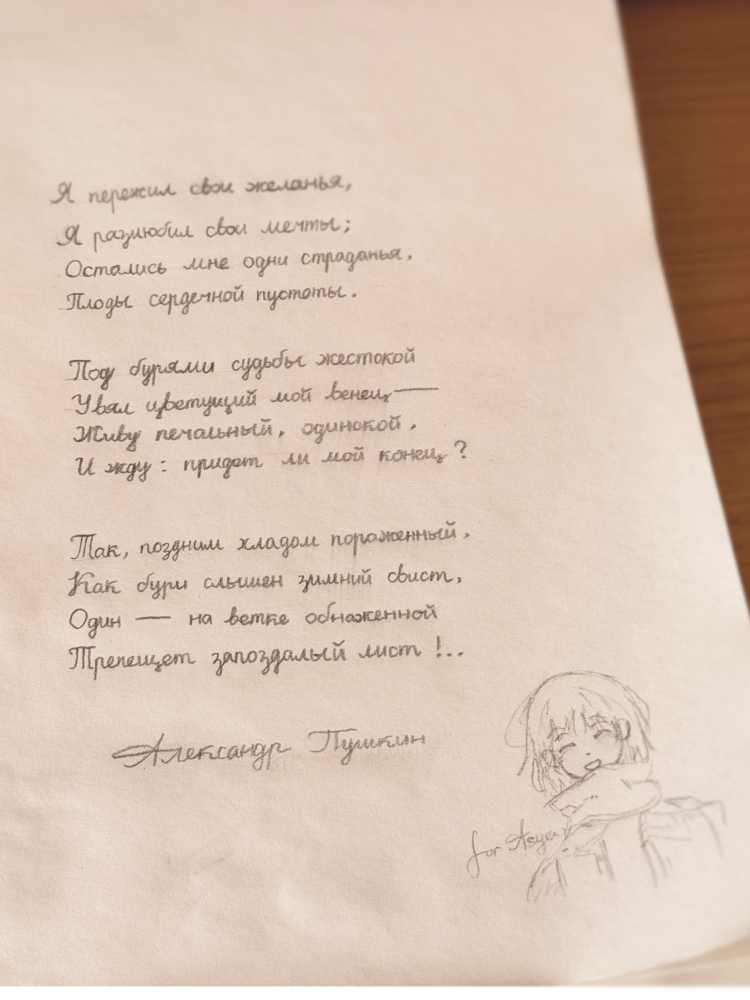

这是一篇2025年11月10日发售的视觉小说[《Z.A.T.O. // I Love the World and Everything In It》](https://store.steampowered.com/app/4122860)的玩（读？）后感。

游玩时间：2026.2.11到2026.2.18。

---

以下：

我几乎从不写日记，但这种偶尔把想到的事写下来的方式很适合去记录这些零碎的感想。所以后续内容以日记的方式呈现。

可能包含游戏内容的轻微剧透。

## 二月十四日午间（之二）

你的生活中，有没有出现过奇迹？有没有发生过你希望被拯救，结果真的有人从天而降拯救你于绝望的桥段？有吗？真的？

不，那不是奇迹。那是你的意志洞穿了宇宙的荚膜，造成的失真。

没关系，你不特殊。每个人都有这种能力。

## 二月十三日晚间

很明显，我们生活的现实世界并不会有所谓的「超感知性」。只是，有些时候我们需要像扮演另一个人一样假装成为「自己」——在什么时候需要说出什么样的话、做出什么样的反应，以满足社会的需要，不被「抹除」。而一旦你开始这么做，你就需要不断地练习，以至于不把它遗忘。无论这是为了虚荣、面子还是亲情、友情，它们最终会成为自我的一部分，永久地改变你的性格。

人是社会性动物。上述不只是我们所说的「人情世故」与其通常附带的贬义的一面，它们可以成为人类性格塑造的另一种逻辑性解释。

宇宙希望我们变得更好，为我们精心安排了新的人生。

用Z.A.T.O.的话来说。

## 二月十一日午夜

无论哪个时代都有一批人在严肃地创作文学。语言是活的，文字是语言的有损快照，但文字自始至终承载着远超出其物质意义的情感。所谓「严肃创作」，不同时代的产物也可以大相径庭。但它们的创作者们，一定都是爱着他们的语言，也同样爱着他们的文字的。

文字的魅力，在于读者可以从黑与白的冷淡与章法构词的规约中感觉出热情、狂妄、爱、自由与梦。

是的，阅读与写作，似如对弈。可以是创作者与阅读者的对弈，也可以是创作者与自身、阅读者与自身的孤独棋局。超乎无穷的变换仅仅是暗含在条框规则中，如此冷酷，却构铸着人类精神殿堂的基座——文字保证了抽象的思绪可以被传承、纪念，也允许后世出现注定有所偏差的无数种解读。

也许我的文字是丑陋的，但我落子无悔。我也只是深爱着我的文字，而她不需要拥有多余的修饰，哪怕如此朴素，甚至于「干燥」「冰冷」「生硬」「做作」——当读者如此思考时，文字已经完成了她的使命。

我还有很多需要练习，自然语序、逻辑重音、措辞、断句、修辞……但有了这些，文字也绝不应该成为主宰读者情感的框架。文字是情感生发的基底和下限，至此，至好。

## 二月十一日晚间

有一种写作方式，就是去不断解构自己产出的文字，根据历史信息寻找下文的灵感。

有点像大语言模型，哈。

## 二月十四日午间（之一）

离开沃尔库塔-5之前，你需要先否认它的存在。它的一切，你的一切，有关于研究中心的一切。

沃尔库塔-5是一座注定被遗忘的城市。对外界来说，它是不存在的记忆。

而被遗忘，比死亡更加可怖。

……

听我说，当你看到本不该看到的记忆，出现精神无法控制的行为时，那一定是你造成了某种「扰动」。你是错误的源头。

一定是这样，对吗？

沃尔库塔-5是一座不允许出错的城市。一切都整洁、干净。

## 二月十七日早间

当你意识到自己注定要从世界上消失时，你会改变些什么吗？你想让更多的人记住自己，想探索宇宙中更多的角落，或是打算用剩余的时间尝试接受这个事实吗？

当你意识到你身边的人，你的家园，你所在的城市正在消失，并注定消失时，你会不会觉得再多的努力都无法再产生一点涟漪？这里和它其中的一切随着时间的轨道笔直前进，越来越小，越来越快，这条轨道上的一切曲折障碍都会随着度量尺度的扩大而被时间无情抹平。一切都只会不可逆转地前进，前进。

除非——这种影响足够伟大，伟大到——在无穷的尺度下，这种影响也是无穷的。那么，那么时间的轨道将会是一条无尽头的直线被无尽头地扭曲……只有一种形状可以做到，那就是圆！时间的轨道是一个无穷大的圆！

……哈。无穷大的圆，那会是什么样呢。一定很可爱。

无穷大的圆，在任意非无穷的尺度下都是直线。而对无穷大的圆绕行一圈，需要的时间也是无穷。那，无穷大的圆和无穷长的直线有什么区别？

……

相比起无情的笔直，宇宙应该更喜欢圆圆的东西吧。毕竟你看，宇宙中的一切都是那么地可爱。

当我意识到自己注定要从世界上消失时，无论还剩下多少时间，我都会去更爱这个世界。

## 二月十四日午间（之三）

当你认识到宇宙中的一切早已被先验地确定时，残存的感性只会变成决定论的荒谬注脚。无论自己做些什么，无论身边的人做些什么，宇宙不会因此变好。宇宙只是按照既定的脚本无休止地进行着，在无穷的尺度下，无论多么巨大的扰动都不会再影响一条直线的度量。扰动会被修正，被无穷的尺度遗忘，最终消失。

研究中心生产的药物能够抑制一切情感。不再有痛苦，不再有幻视，但也不再有快乐和共情。在仅存理性的人性上，一切都是假的。欢笑是假的，哭泣是假的，「朋友」也是假的。可就算这样，药物也只是延缓了一切的发生。

如果没有药物干涉，患「病」的人们很快就会被混乱的记忆占据，原本的人格被抽离，变成无法交流、无法理解的躯壳。

然后——消失。

宇宙在纠正他们造成的扰动。

宇宙在纠正研究中心造成的扰动。

宇宙在纠正沃尔库塔-5造成的扰动。本不该存在的东西，什么时候消失都一样。

它 需 要 被 修 正。

## 二月十七日午夜

你认为一个人可以理解死亡吗？

一个具有自由意志的生命，在面对这种剥夺其一切思考能力的事件时，与没有自由意志的生命完全平等。甚至更糟。死亡对我们来说有独特的可怖：在这一瞬间之后，一切并非化为乌有，而是仍如往常一般运行着，只是你的实体不再存在于任何一面光锥之下；你无法再对这个世界进行任何感知与沟通，无法想象自己无法思考的样子；你无法再纠正自己在他人记忆中的模样，而这些剪影最终也只会愈发模糊，在不久之后你或将真正不复存在，或化为碎片的文字和符号，继续被人们解构与重组；而这些都与「你」无关，毕竟你已经死了。

但人类的可怕之处在于，他们可以想像自己死后身边人仍然在思考的模样。他们可以想像社会没有自己却仍在运行的模样。他们可以想像自己作为文字，作为故事，作为符号被记录、传播、变形、被重新认识的模样。尽管他们终有一死，但他们可以预支未来以填充现世的生命。

对于「失去」，普遍的心理认知有否认、愤怒、反驳、抑郁、接受这五个阶段。只不过，对于生命的死亡这样来自物理规律的降维打击，我们无从否认与反驳，只有强烈的抑郁和最终的接受（不一定释然）。没了前三个阶段的缓冲，陡峭的心理压力变化很容易让心智失衡，人类很容易因此很长时间，或者永远，都无法从面对死亡的阴影中走出来。

可是人类社会是建立在死亡之上的。与死亡的可怕伴生的，是无穷的生命可能性。假如个体可以跳过死亡，实现永恒，或是死亡的机制从未诞生，一切生存之物都不可磨灭，那么对任何现存的部分进行削减都是对自然律的违反。一切的诞生需要极其小心的布局，因为他们失去了湮灭彼此的能力。只增不减，宇宙是单调的。那么一切都没有必要诞生。所以，诞生的前提是死亡。一次诞生的产物必然会因一次死亡而终结。

人的智慧认识到，死亡之后的世界，是不再有自我参与的世界。但对人类来说，死亡却并不只意味着与世界的断联。他们有一天意识到，人性可以脱离原初的那个头脑而存在。社会化的人格中，人性是由个体的思考力和社会的塑造力所糅合而成的，人们利用人性中社会化的部分进行共情、回溯历史、预测未来。一个人会意识到死亡带来的个体的虚无，所以他会寻求现世的快乐。一个人会为了未来社会中同胞们所不用面对如此无意义的死亡而牺牲，也因此如此的死亡不再是无意义的。一个人会因为联想到祖先们面对死亡的思考与死后留给社会的遗产而或是敬仰，或是鄙视，或是铭记一部分历史。一个人的人生终究要面对死亡，所以他活着就是为了让他的人生意义不只有这一死亡。

向死而生是人类生命的大母题。

## 二月十八日午夜

宇宙会自我疗愈。

让伤口恢复，不再流出那些黑色的，粘稠的汽油味液体。

有一些事情对于人类来说终究是无法理解。不过究其根本，人类的诞生本就不是为了去解读宇宙，大概吧。

当你急切地希望一件事发生时，当你的愿望如此强烈时，宇宙的意志会向你倾斜。

可谁的意志可以向宇宙倾斜呢？

宇宙在无穷的时间中占据着无穷的空间，能够看到无穷无尽的一切事物。

不。

宇宙观察着一切，可谁来观察宇宙呢？

宇宙注定要忍受无穷的孤独吗……？

……

你是谁？

我……是谁？

不重要。我隐约记得我见过你无数次。现在，就只有我们两个人在这，在这个莫名其妙的地方，这不就是证明吗？

我们一定是最好的朋友。

遗忘侵蚀着一切。越来越快。打破北极圈的永夜的那一轮红日燃烧着天际线，燃烧着我们脚下的整座城市。

我们来这里……是干什么？

好像是一件很重要的事。好像是要……给谁发送……发送信息？

……什么信息？给谁？！

不知道……我什么都想不起来。

……

嗯……只有你和我在这里，那也就是说，只有一种可能了！

准备好接收我的信号了吗！

……！呃？嗯……好的！准备好了！……

……

我爱你。

……

1986年12月28日晨，无线电淹没了沃尔库塔-5。

---

以上。

Z.A.T.O.是一个需要对上电波的游戏。甚至不能算是游戏。没有选项，没有支线和多结局，一切都只是按照既定的剧本无情地进行着。只是，超越文字的媒介，得以让这个故事变得更加完美。来自波兰的创作者Ferry // Nopanamaman是一位经验丰富的画师，而她那可爱中带有一些粗犷，外加几分愤世嫉俗的画风配合上高清像素艺术和明暗分明、低饱和的苏联美学时，Z.A.T.O.的美，得以被淋漓尽致地体现出来。

Z.A.T.O.的故事是严肃的。八十年代，苏联，不存在的城市，秘密进行的实验，精神错乱，彻底消失……在我们的历史中也发生过类似的事吧。但Z.A.T.O.带给我们的视角，大部分时候却是活泼、乐观甚至有点幼稚的。故事不存在什么大反转，一切的进行似乎都早已有所预兆，只是当事实真正猛烈地袭来时，你会发现之前做的再多准备都没有用。正如同面对死亡。Z.A.T.O.尝试告诉我们如何用一生去为终将到来的死亡做准备，如何在面对死亡时依然爱这个世界。

面对死亡这般庞大的议题，我们需要的也许正是少年少女们那稚气未脱，充盈着青春期的倔强和对宇宙最纯洁美好的期待的心态。

Z.A.T.O.把一个硬核的故事用柔软的外壳包裹，而Z.A.T.O.的美术风格，又仿佛将一些柔软的东西容纳进了无可协商的像素网格。文本配合着画幅改变、色调转换与字体和背景音乐的演出（作者说Z.A.T.O.的音乐都是挑选的无版权费网络音乐，但选品非常到位），还有一些恰到好处的意识流表演，让整个故事的演绎效果达到了巅峰。

《Z.A.T.O. // I Love the World and Everything In It》就是一款这样的游戏。她的流程不长，像我一样拖延这么久也才玩了不到7小时，但在这7小时中，她引发了我要把一直以来的诸多思考写下来的念头。所以就有了这篇颇显杂乱的文字。

还有许多想写下来的，就留给下一次这样的机会吧。

---

Z.A.T.O.的创作者Ferry同时也是一位Vocaloid词曲作者，她的音乐和PV也有一种来自苏联的独特美学气息。她的平台主页链接在Linktree集散，https://linktr.ee/nopanamaman 。

Z.A.T.O.是免费的，任何人都可以无门槛地体验这份无与伦比的剧情演出。……好吧，可能有一个门槛：在macOS平台上，她只支持32位处理器。

关于爱与不爱的问题，Steam简中评论区的第一条评论显然讨论得比我更加深入。它也解答了标题中「Z.A.T.O.」的含义：

> 我问Gemini，Z.A.T.O.这个词是什么意思。Gemini说这是“保密行政区（Zakrytoye Administrativno-Territorial'noye Obrazovaniye）”的简称，但它也说，zato（зато）是俄语的连接词，意思是“即便如此”。  
>  
> ——即便如此，我也爱着这个世界和它的一切。但是现在，我把它的后半句注释掉了。至此，标题里那个令人困惑的双斜杠的涵义，我也确实地知道了。

**所以，_ЗАТО_，我仍然会爱这个世界！**

